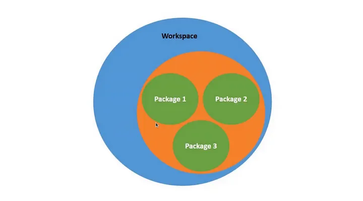

# ros2_tutorial
This repository contains a collection of notes and resources for new users of ROS2.
# Concept ภาพรวมของ ROS2
ไฟล์ทั้งหมดที่ใช้ในการทำงานของ ROS2 จะต้องเก็บไว้ใน folder ที่เป็น Workspace ของการทำงาน


## การสร้าง workspace
Important Note

ห้าม copy workspace ทั้ง folder  ต้องสร้างจากคำสั่ง 
```console
$ mkdir bumperbot_ws/src
``` 
```console
$ cd smartbot_ws/ 
```
และ 
```console

$ colcon build   
```

หลังจากที่ใช้ colcon build แล้ว จะได้ folder เพิ่ม ได้แก่ build install และ log ซึ่งมีโครงสร้างเฉพาะตามแบบของ ROS2 โดยมี src เป็น folder ในการเก็บไฟล์ที่จะพัฒนาขึ้นเป็นโปรแกรม ทั้ง python และ cpp

build จะเก็บไฟล์ที่คำสั่ง colcon สร้างขึ้นและอาจสร้าง subfolder เพื่อเก็บ package ต่างๆ ที่สร้างขึ้นจากไฟล์ใน src 

install ะเก็บไฟล์ที่เป็นการทำงานของ package ต่างๆ ที่ลงไว้ และมี .exe ไฟล์ที่สร้างขึ้นด้วย

จากนั้นให้ไปที่ folder src
ห้าม copy package ทั้ง folder ต้องสร้างจากคำสั่ง 
```console
$ cd src/
$ ros2 pkg create --build-type ament_python­ <name of package>
```
เช่น
```console
~/ros2_tutorial/smartbot_ws/src$ ros2 pkg create --build-type ament_python smartbot_py_examples
~/ros2_tutorial/smartbot_ws/src$ ros2 pkg create --build-type ament_cmake smartbot_cpp_examples
```
คำสั่งข้างต้นจะสร้าง folder ใหม่ขึ้น ได้แก่ smartbot_cpp_examples  smartbot_py_examples ซึ่งทั้ง 2 จำเป็น ros2 package ใหม่ที่เราสร้างขึ้นมาเอง

จากนั้นให้กลับไปที่ workspace folder
```console
~/ros2_tutorial/smartbot_ws/src$ cd ..
~/ros2_tutorial/smartbot_ws/src$ colcon build
```

ซึ่งจะเห็นว่า ros2 ได้สร้าง package ใหม่ขึ้น
```console
Starting >>> smartbot_cpp_examples
Starting >>> smartbot_py_examples
Finished <<< smartbot_py_examples [0.79s]                                                           
Finished <<< smartbot_cpp_examples [1.01s]  
```

จากนั้นต้องทำให้ workspace รู้จักกับ overlay package ใหม่ เรียกว่า  source file 


ให้เปิด terminal ใหม่ และใช้คำสั่ง
```console
(base) ~$ cd ros2_tutorial/
(base) ~/ros2_tutorial$ ls
img  README.md  smartbot_ws
(base) ~/ros2_tutorial$ cd smartbot_ws/
(base) ~/ros2_tutorial/smartbot_ws$ ls
build  install  log  src
(base) ~/ros2_tutorial/smartbot_ws$ cd install
(base) ~/ros2_tutorial/smartbot_ws/install$ . setup.bash
(base) ~/ros2_tutorial/smartbot_ws/install$ ros2 pkg list
```

*** ต้อง source file setup.bash ใหม่ทุกครั้งที่เริ่ม Terminal ใหม่ ***

คำสั่ง $ ros2 pkg list จำแสดงรายการ package ที่พร้อมใช้ ทั้งจาก overlay และ underlay

----------------------
## ทดสอบการใช้งาน ros2 ด้วย simple_pubisher \
Lec#24 <py> simple_publisher</py> 


1. ให้ copy ไฟล์ simple_publisher.py  
1. copy ไฟล์ package.xml
1. copy ไฟล์ setup.py
1. ทำตามภาพด้านล่าง


